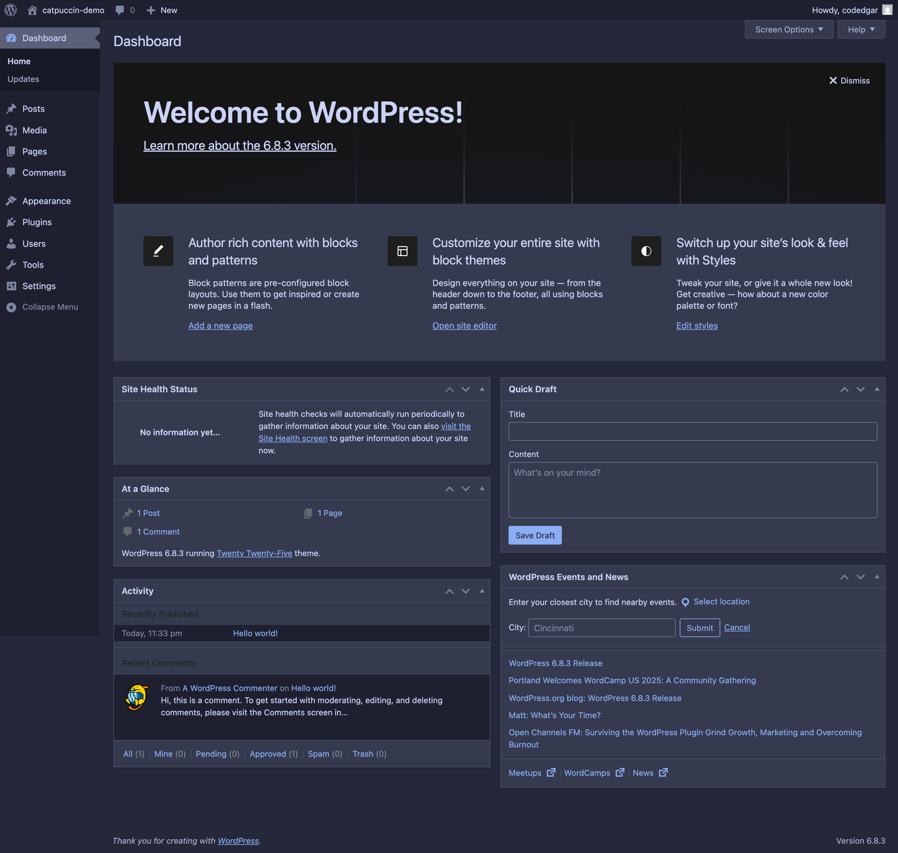
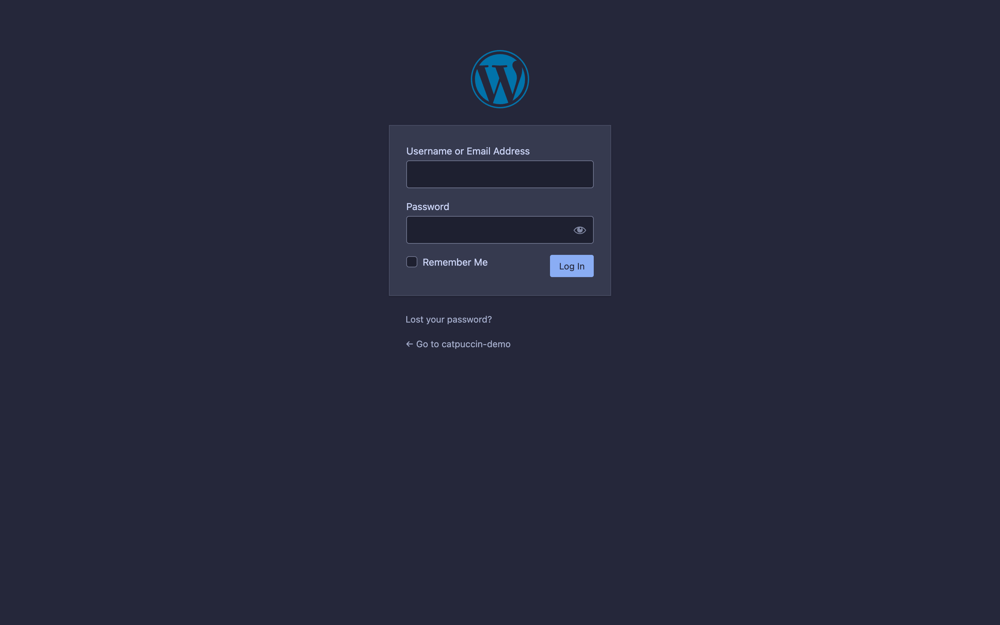
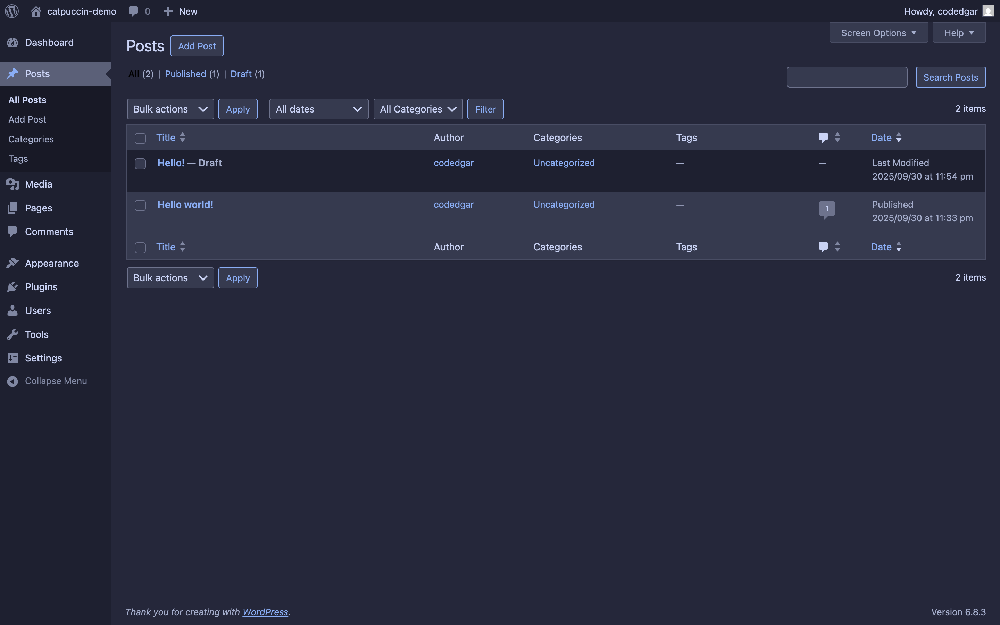
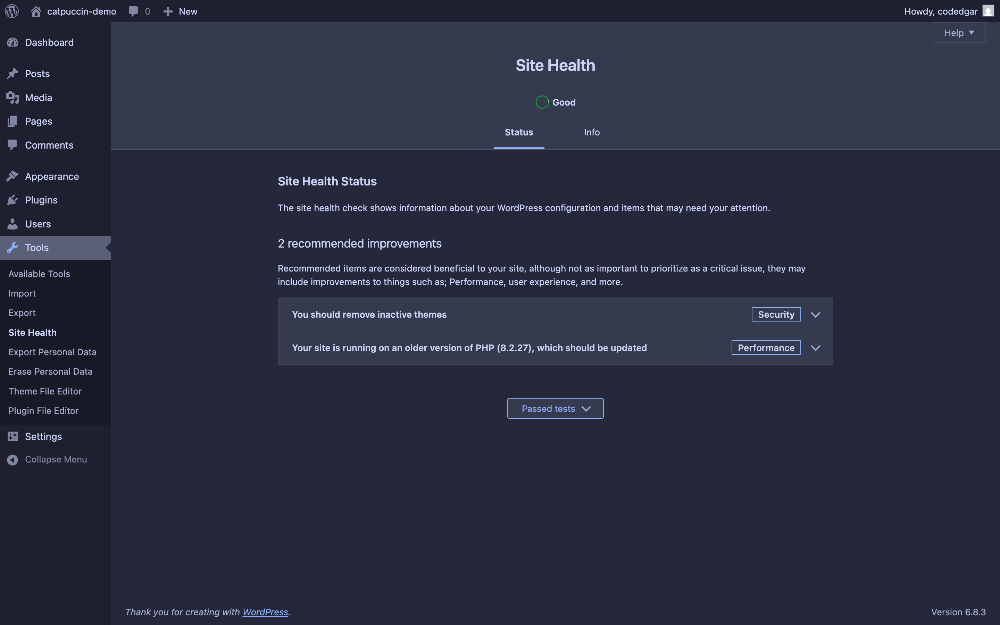
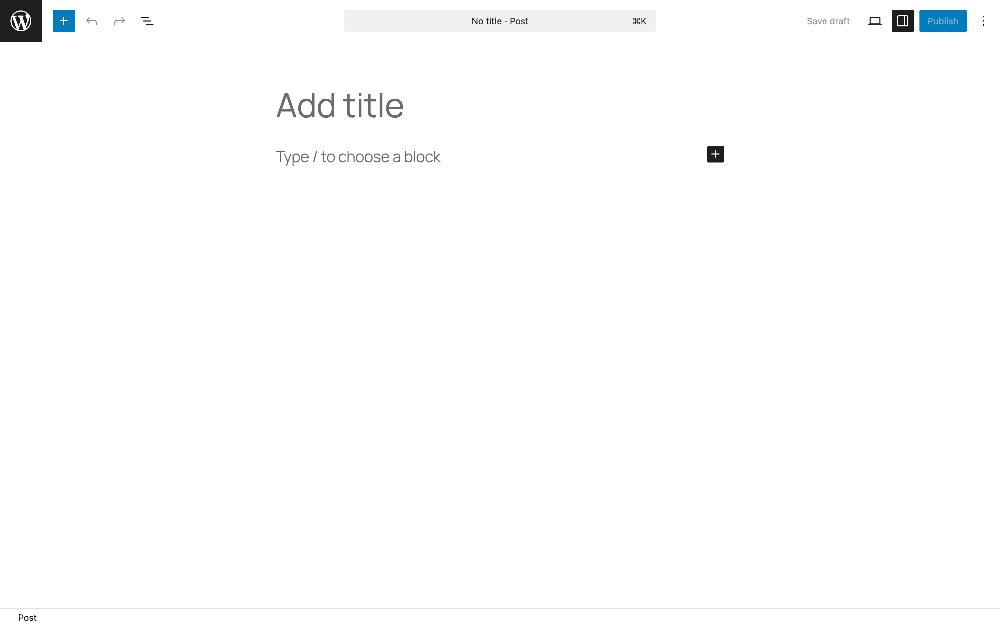

# Catppuccin for WordPress

[](https://github.com/codedgar/Catppuccin-WordPress/releases)
[](LICENSE)
[](https://userstyles.world/style/style-id)
[](https://github.com/codedgar/Catppuccin-WordPress/stargazers)

A comprehensive dark theme that applies the [Catppuccin](https://github.com/catppuccin/catppuccin) Macchiato color palette to the entire WordPress admin interface.

> **Note**: Currently only the Macchiato flavor is available. Additional flavors (Latte, Frappé, Mocha) may be added based on community interest.

## ✨ Features

- 🎨 Complete WordPress admin interface styling
- 🔐 Login page theming
- 🛡️ Full Wordfence Security support (Free & Premium)
- 👁️ Dark mode optimized for reduced eye strain
- 🎯 3,500+ lines of comprehensive CSS coverage
- 🔄 Consistent Catppuccin Macchiato color palette throughout

## 📦 Installation

### Option 1: Stylus Browser Extension (Recommended)

The easiest way to use this theme without modifying your WordPress installation:

1. Install [Stylus](https://github.com/openstyles/stylus) for your browser:
   - [Chrome/Edge](https://chrome.google.com/webstore/detail/stylus/clngdbkpkpeebahjckkjfobafhncgmne)
   - [Firefox](https://addons.mozilla.org/firefox/addon/styl-us/)

2. Install the theme:
   - ~~**From userstyles.world**: [Click here to install](https://userstyles.world/style/style-id)~~ Not available yet
   - **From GitHub**: [Install directly](https://raw.githubusercontent.com/codedgar/Catppuccin-WordPress/main/stylus/macchiato.user.css)

3. The theme will automatically apply to any WordPress admin interface you visit

**Benefits of Stylus:**
- No WordPress modifications needed
- Easy to enable/disable per-site
- Works across multiple WordPress installations
- Updates don't affect your WordPress setup
- Can be synchronized across browsers

### Option 2: WordPress Plugin

Install directly into your WordPress site:

1. Download the [latest release](https://github.com/codedgar/Catppuccin-WordPress/releases/latest)
2. In WordPress admin, navigate to **Plugins → Add New → Upload Plugin**
3. Upload the ZIP file and click **Install Now**
4. Click **Activate** to enable the theme

## 🎨 What's Styled

This theme provides comprehensive coverage of:

### Core WordPress
- Admin dashboard and all widgets
- Post and page editor
- Media library and uploader
- Settings pages
- Navigation menu builder
- Widget customizer
- Theme and plugin browsers
- User profiles
- All form controls (inputs, checkboxes, radios, selects, textareas)
- Tables and list views
- Notifications and alerts
- Metaboxes and postboxes
- Login page

### Wordfence Security
- Dashboard widgets
- Activity reports and live traffic
- Scan interface and results
- WAF configuration
- Firewall rules
- All modals and alerts
- Premium features UI

### Additional Coverage
- Site health pages
- Privacy settings
- About/Credits pages
- File editors
- Revision comparisons
- Custom fields

## 🎨 Color Palette

The theme uses the Catppuccin Macchiato color scheme:

| Color | Hex | Usage |
|-------|-----|-------|
| Base | `#24273a` | Primary background |
| Mantle | `#1e2030` | Secondary background |
| Surface | `#363a4f` | Tertiary background |
| Text | `#cad3f5` | Primary text |
| Blue | `#8aadf4` | Primary accent & links |
| Sapphire | `#7dc4e4` | Hover states |
| Green | `#a6da95` | Success messages |
| Red | `#ed8796` | Errors & delete actions |
| Yellow | `#eed49f` | Warnings |
| Overlay | `#6e738d` | Borders & disabled states |

[View full palette →](https://github.com/catppuccin/catppuccin#-palette)

## 🖼️ Screenshots


*Dashboard with dark theme applied*


*Login page styling*


*Posts page styling*


*Site Health Page*


*Post editor interface* (Notice it does not have any styles)

## 🛠️ Customization

To customize colors, you can modify the CSS variables at the top of the stylesheet:

```css
:root {
  --ctp-macchiato-blue: #8aadf4;     /* Primary accent color */
  --ctp-macchiato-text: #cad3f5;     /* Main text color */
  --ctp-macchiato-base: #24273a;     /* Background color */
  /* ... other variables */
}
```

## 🤝 Contributing

Contributions are welcome! If you find areas that aren't properly styled or have suggestions:

1. Check existing [issues](https://github.com/codedgar/Catppuccin-WordPress/issues) first
2. Open a new issue with:
   - Screenshot of the problem
   - WordPress version
   - Relevant plugins installed
   - Browser (if using Stylus)
3. Or submit a pull request with your fix

## 🐛 Known Issues

- Some third-party plugins may have inline styles that override the theme
- Block editor (Gutenberg) has limited styling due to iframe isolation
- TinyMCE visual editor has partial support

## 📝 Changelog

### Version 1.0.0 (Sep 30 2025)
- Initial release
- Full WordPress admin interface support
- Complete Wordfence styling
- Login page theming
- Stylus and plugin installation options

## 📜 License

[GPL-2.0-or-later](LICENSE)

## 💖 Credits

- **Color scheme**: [Catppuccin](https://github.com/catppuccin/catppuccin) by the Catppuccin community
- **WordPress**: The WordPress Foundation
- **Wordfence**: Defiant Inc.

## 🔗 Links

- [Report a Bug](https://github.com/codedgar/Catppuccin-WordPress/issues)
- [Request a Feature](https://github.com/codedgar/Catppuccin-WordPress/issues)
- [Catppuccin Organization](https://github.com/catppuccin)
- ~~[userstyles.world Page](https://userstyles.world/style/style-id)~~

<p align="center">
  
</p>

<p align="center">
  Made with 💙 by Codedgar, for the Catppuccin community
</p>